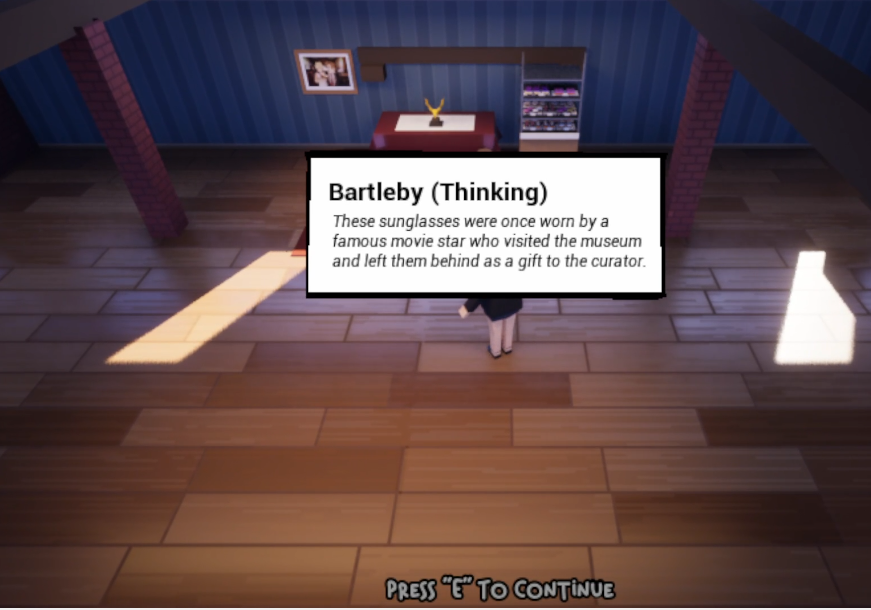

# BartlebyUE5
 A very simple integration layer between OpenAI and UE5 that I made for my own learning and enjoyment.

## What is it?
This integrates ChatGPT with Unreal Engine 5 in the simplest way possible. It's called "bartleby" because that's what I called the original agent, a tour guide named Bartleby.

* Creates an agent (BartlebyController) with a limited number of "actions".
* Creates a set of "rooms" that the controller knows about. These are just boxes.
* Creates a set of "objects" that are in each "room".
* Creates "doors" between each room.
* Manages prompting ChatGPT with info from the Bartleby controller.
* Manages parsing the response from ChatGPT into an action.

## Requirements
* Unreal Engine 5
* A UE5 project in C++.
* OpenAI api key.

## Getting started
1. Copy this code into your project.
2. Add a `BartlebySystem` actor to your game.
3. Get an OpenAI API key.
4. Set the OpenAI API key in the BartlebySystem.
5. Add an ACharacter that is controlled by the `BartlebyController` to your environment. Make sure there is a navigation mesh so the character can walk around.
6. Add a number of `BartlebyRoom` actors to your environment.
7. For different actors in your environment, add a `BartlebyObject` component to them.
8. Change the Id and description of each room, object, etc.
9. In `BartlebySystem`, manually add doors (yeah, this is dumb). These tell the agent which rooms are available.
10. Add a player controller.
11. Add a `BartlebyInput` widget. To do this, make a `UMG` widget that extends from `BartlebyInput`. Pass this to the `BartlebySystem`. The UMG widget needs to set `InputText`.
12. Extend or modify `BartlebySystem` to implement `Say`. I tried to extract this from my own game, but it was too tied up with the stuff I implemented for fancy word bubbles to include here. The simplest implementation of Say would be printing to the console. You can do this in blueprint if you like.

## Desired behavior
1. When you get near enough to the bartleby agent, it should say something.
2. Then it should go somewhere, maybe examine an object, and say something more.
3. You should be prompted with something to say.
4. When you click "say", the AI should respond to you.

## Known Limitations
* This can get expensive. It's cost me less than $10 so far, but obviously the more you use it the more expensive it is.
* Error handling from the JSON parsing can be spotty. No explicit attempt is made to limit the number of tokens to an exact amount. Once that happens the AI may get confused.
* The AI likes to talk A LOT. I've made some attempt to make it say less and *do* more, but it really likes to talk.
* The memory is extremely limited. Maybe this is better on GPT-4, but on GPT-3.5 Bartleby can forget he went to a particular room quite frequently.

## Can I use this in my game?
MIT licensed. Do whatever you want with it.

